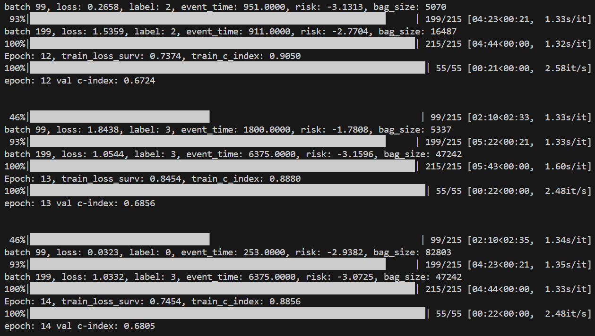
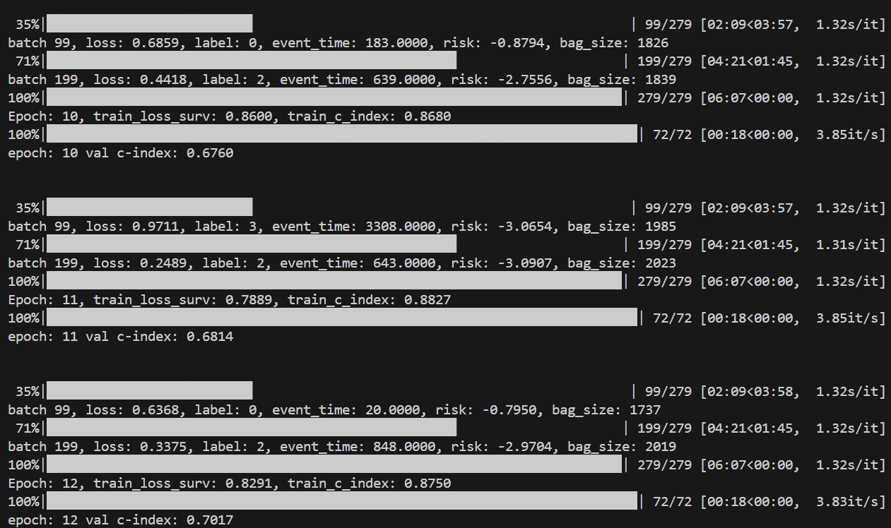

# LCM-Net

> **Note:** This repository contains the **initial** public release of the code.  
> Due to current time constraints, the implementation and documentation may be relatively rough at this stage.  
> If you encounter any issues, please open an issue or contact **syang671@connect.hkust-gz.edu.cn**.

## Installation
```bash
pip install -r requirements.txt
```

## Quick Start

This quick start demonstrates a minimal forward pass of the MEI module in LCM-Net,
without requiring full dataset preparation.

```python
import torch
import torch.nn as nn
from models.LCM_net_utils.MEI.model_MEI import MEI

def main():
    device = "cuda" if torch.cuda.is_available() else "cpu"

    # -------------------------
    # Dummy inputs
    # -------------------------
    B = 1        # batch size
    C = 256      # gene feature dimension
    N = 128      # number of pathology tokens
    Cp = 1024    # raw pathology feature dimension

    F_gene = torch.randn(B, C, device=device)
    F_path_raw = torch.randn(N, Cp, device=device)

    # Project pathology features to shared dimension
    path_proj = nn.Linear(Cp, C).to(device)
    F_path = path_proj(F_path_raw)   # (N, C)

    # -------------------------
    # Initialize MEI
    # -------------------------
    model = MEI(
        dim=C,
        Ng=4,     # gene experts
        Np=4,     # pathology experts
        Nf=2,     # fusion experts
        p_drop=0.1
    ).to(device)

    # -------------------------
    # Forward pass
    # -------------------------
    model.eval()
    with torch.no_grad():
        F_out, _ = model(F_gene, F_path)

    print("Output feature shape:", F_out.shape)  # (1, 256)

if __name__ == "__main__":
    main()
```

## Data Preparation

### Preparing the Raw Data

Please refer to the [TCGA portal](https://portal.gdc.cancer.gov/) to download the raw data, including raw whole-slide images (WSIs) and gene expression data.

### Embedding the WSIs

For WSIs, please refer to [CLAM](https://github.com/mahmoodlab/CLAM) and [UNI](https://github.com/mahmoodlab/UNI) for details on how to represent these gigapixel whole-slide images.

The pathology data structure should be organized as follows:

```
Pathology
-- BRCA
---- masks
---- patches
---- ptfiles    # vision embeddings
---- stitches
```

### Gene Preprocessing Scripts

The data preprocessing scripts are provided under `data_preprocessing/`:

- `data_preprocessing/generate_splits.py`  
  Generate dataset splits (e.g., 5-fold cross-validation), following the implementation in [MOTCAT](https://github.com/Innse/MOTCat).

- `data_preprocessing/preprocess_gene_survival.py`  
  Preprocess gene expression and survival information into tabular data.

- `data_preprocessing/convert_h5_to_parquet.py`  
  Convert raw gene data from `.h5` format to processed parquet files.

### Data Locations for Reproducibility

Gene data (processed tabular-like data):  
e.g., /vip_media/sicheng/DataShare/tmi_re/Gene_data_parquet/{dataset_name}_data.parquet

Pathology feature files (.pt directory):  
e.g., /vip_media/sicheng/DataShare/tmi_re/UNI_results/UNI_{dataset_name}/pt_files

Data splits (refer to the implementation in [MOTCAT](https://github.com/Innse/MOTCat)):  
e.g., /vip_media/sicheng/DataShare/tmi_re/ours/splits/5foldcv

LLaMA-2-7B (HuggingFace format) weights ([official link](https://huggingface.co/meta-llama/Llama-2-7b-hf)):  
e.g., /vip_media/sicheng/DataShare/Llama-2-7b-hf


## Running Experiments


### Multimodal

```bash
CUDA_VISIBLE_DEVICES=1 python main.py --model_type lcmnet --mode coattn
```
### Genomic
```bash
CUDA_VISIBLE_DEVICES=1 python main.py --model_type snn --mode omic
```
### Pathology
```bash
CUDA_VISIBLE_DEVICES=1 python main.py --model_type transmil --mode path 
```

## Expected Results

**Running example**  
An example on the CESC dataset.


An example on the LIHC dataset (with PFR).


## Acknowledgments

The LCM-Net codebase adapts components from
[MOTCAT](https://github.com/Innse/MOTCat),
[CLAM](https://github.com/mahmoodlab/CLAM), [CMTA](https://github.com/FT-ZHOU-ZZZ/CMTA), [UNI](https://github.com/mahmoodlab/UNI) and
[GIO](https://github.com/daeveraert/gradient-information-optimization).
We thank the authors for their excellent work.

I thank [Haipeng Zhou](https://haipengzhou856.github.io/) for his mentorship and for his important contributions to the project, including conceptual discussions and data support.

